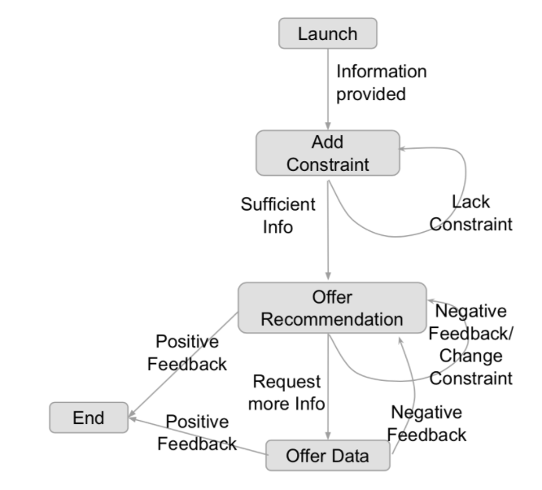
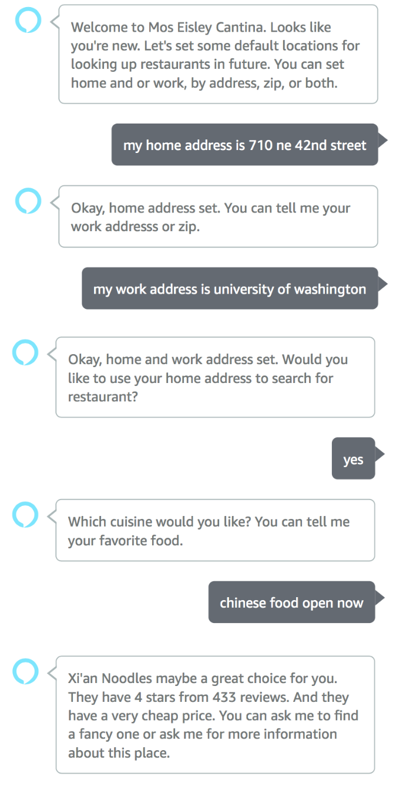
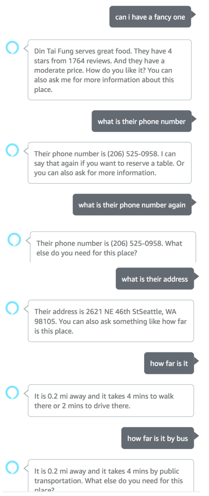
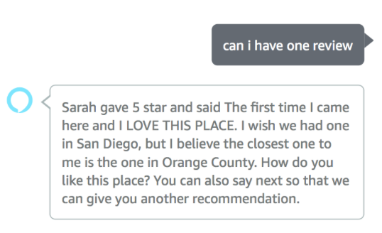
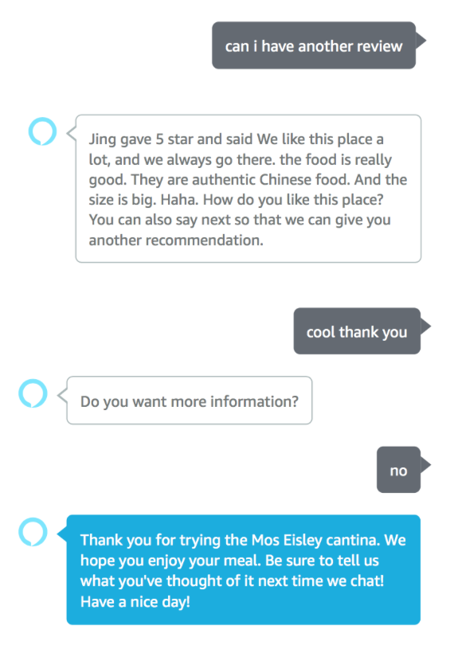

# Mos Eisley Cantina
**An Alexa-based restaurant recommendation system**  [[slides]](https://hao-fang.github.io/ee596_spr2018/slides/showcase/MosEisleyCantina_slides.pdf) [[poster]](https://hao-fang.github.io/ee596_spr2018/slides/showcase/MosEisleyCantina_poster.pdf)

_Course Project for EE 596 Conversational Artificial Intelligence - University of Washington_ 

## Team 
[Hao(alex) Xiao](https://github.com/AlexXiao95), [Sujie Zhu](https://github.com/sujiezhu), [Qi Hu](https://github.com/eqiihuu), [Brian Moran](https://github.com/bpmoran), [Seraphina Goldfarb-Tarrant](https://github.com/seraphinatarrant),  [Catharine Youngs](https://github.com/cyoungs)

## Running the System

Please refer to [course website](https://hao-fang.github.io/ee596_spr2018/lab1.html).

## Finite State Dialog Manager

 

## Demo

 

 

 

 

